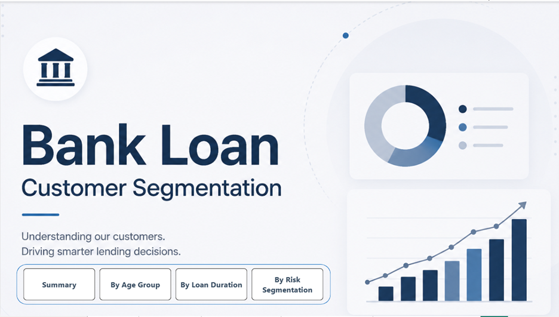
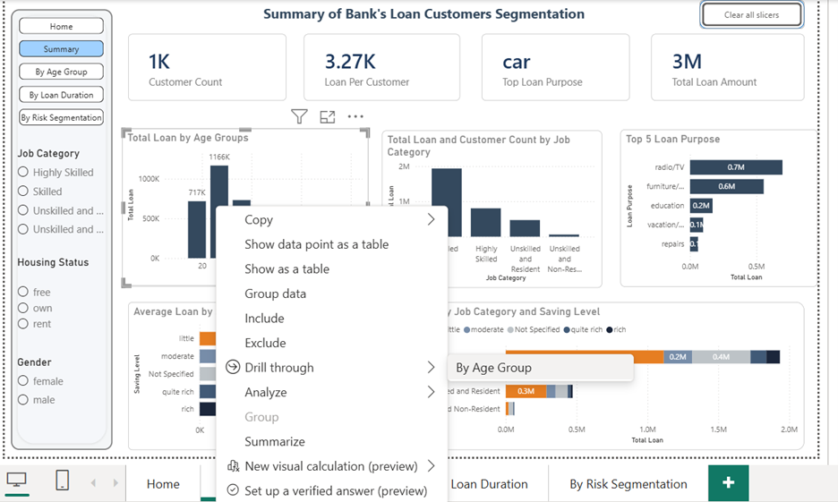
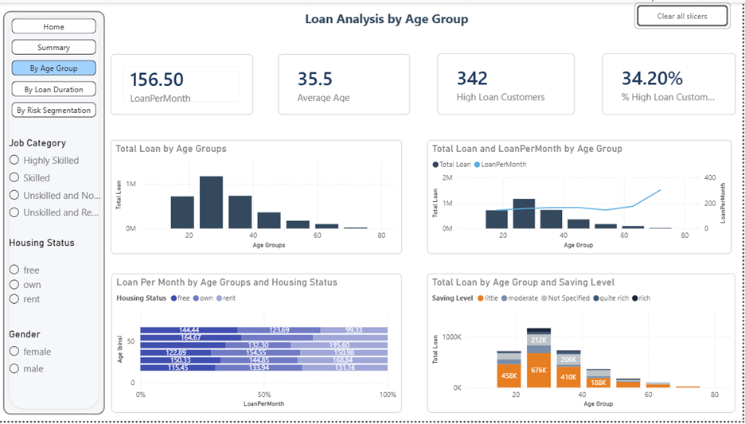
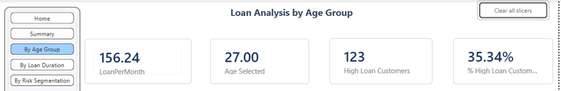
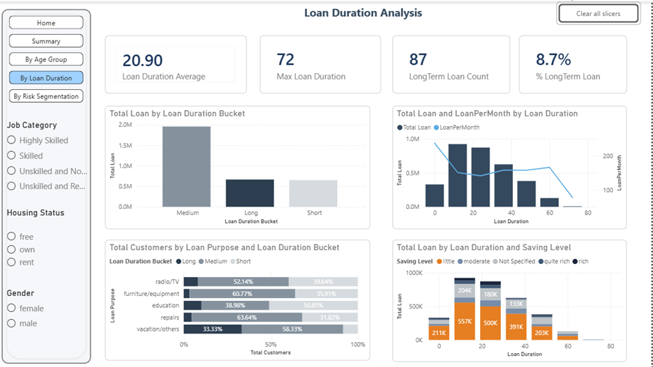
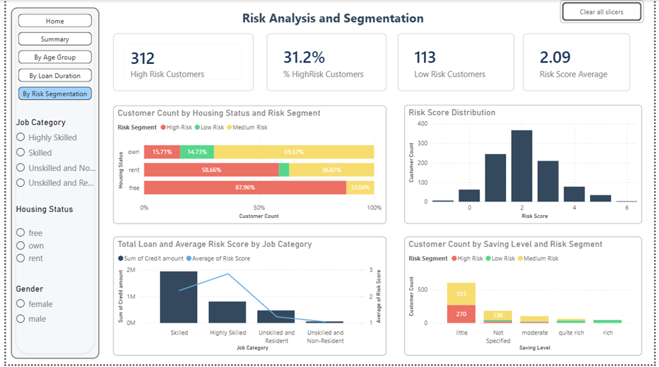

# 📊 Bank Loan Customer Segmentation & Risk Analysis (Power BI)
Power BI dashboard for customer segmentation and risk analysis using feature engineering and DAX.

## 🚀 Project Overview
This project presents an interactive Power BI dashboard designed to analyze customer behavior, loan patterns, and risk segmentation in a banking dataset.

The goal is to move beyond basic visualization by applying feature engineering and business logic to generate actionable insights.

---

## 🔧 Features & Techniques

- Data Cleaning & Transformation
- Feature Engineering:
  - Age Groups & Loan Duration Buckets
  - Loan Per Month metric
  - Custom Risk Score & Risk Segmentation
- DAX Measures for KPIs
- Drill-through functionality
- Dynamic KPI cards

---

## 💡 Risk Scoring Logic

The Risk Score is calculated based on:

- Housing Status  
- Job Category  
- Saving Level  

Each category is assigned a score and combined to create a final Risk Score.

### Risk Segmentation:
- **Low Risk** (Score ≥ 4)  
- **Medium Risk** (Score ≥ 2)  
- **High Risk** (Score < 2)

---

## 📊 Key Insights

- Skilled workers contribute the highest loan volume (~1.9M), despite lower savings
- Average loan burden is ~156/month
- 34% of customers exceed the average loan amount
- Car loans are the most common loan purpose
- 31% of customers fall into High-Risk segment
- Only 8.7% opt for long-term loans (up to 72 months)

---

## ✨ Dashboard Highlights

- Interactive slicers (Job Category, Housing Status, Gender)
- Drill-through from summary to detailed analysis
- Dynamic KPI:
  - Shows Average Age (default)
  - Updates to Selected Age (on drill-through)

---

## 📸 Dashboard Screenshots

### Homepage

### Summary Page

### Age Group Analysis (Normal View)

### Age Group Analysis (Drill-through View)

### Loan Duration Analysis

### Risk Segmentation

---

## 🛠️ Tools Used
- Power BI
- DAX
- Data Modeling

---

## 📌 Author
**Saad Adnan**  
Aspiring Data Analyst | Power BI Developer | Open to opportunities

